# LoRaWAN EndNode Study

[TOC]

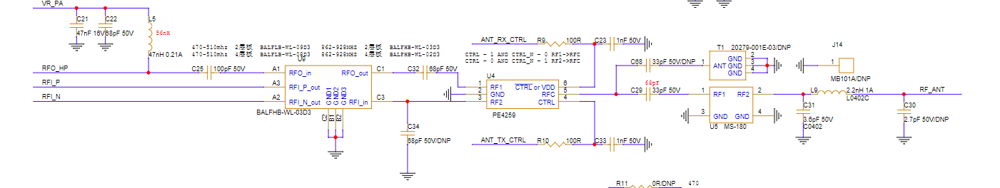

# 1. SUBGHZ

## 1.1 介绍

1. Sub-GHz是指工作频率低于1ghz12的无线网络技术。它因无线电频率低于1 ghz而得名。Sub-GHz 无线电是一种超低功耗 Sub-GHz 无线电，在 150 - 960 MHz ISM 频段运行。 

## 1.2 ST-SUBGHZ

- 模拟前端收发器，能够在其 RFO_LP 引脚上输出高达 + 15 dBm 的最大功率，在 RFO_HP 引脚上输出高达 + 22 dBm 的最大功率 .半双工 150 - 960 MHz ISM sub-GHz 无线电收发器支持.
- LoRa Rx/Tx，带宽 (BW) 为 7.8 - 500 kHz，扩频因子 (SF) 5 - 12，比特率 (BR) 为 0.013 至 17.4 Kbit/s（实际比特率） 
- Sub-GHz 无线电提供了一个内部处理单元来处理与系统 CPU 的通信。通信通过 SPI 接口发送的命令进行处理，并使用一组中断来发出事件信号。 BUSY 信息表示操作活动，并用于指示何时无法接收 sub-GHz 无线电命令

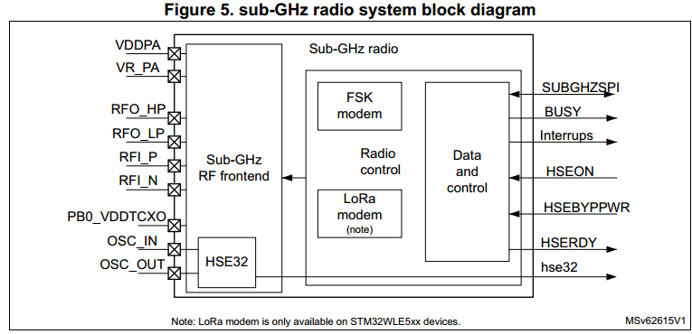

## 1.3 POWER

- VDDRF = 1.71 V 至 3.6 V VDDRF 是无线电的外部电源。它通过 VDDRF 引脚从外部提供，并且必须连接到与 VDD 相同的电源

- LDO 或 SMPS 降压转换器工作模式可通过以下方式之一进行配置： 

  - 由 MCU 使用 PWR 控制寄存器 5 (PWR_CR5) 中的 SMPSEN 设置进行配置，这取决于 MCU 系统工作模式（运行、停止、待机）或关机）。
  - 通过使用SetRegulatorMode() 命令的sub-GHz 无线电和sub-GHz 无线电操作模式（睡眠、校准、待机、使用HSE32 待机或活动）。

- 任何 POR 和 NRST 复位后，都会选择 LDO 模式。 SMPS 选择优先于 LDO 选择。

  当 sub-GHz 无线电处于 HSE32 待机或活动模式时，供电模式不会改变，直到 sub-GHz 无线电进入待机或睡眠模式。 Sub-GHz 无线电活动可能会增加进入 MCU 软件请求供电模式的延迟。LDO 或 SMPS 供电模式可通过电源状态寄存器 2 (PWR_SR2) 中的 SMPSRDY 标志进行检查

- 当无线电处于活动状态时，直到无线电活动完成后供电模式才会更改

  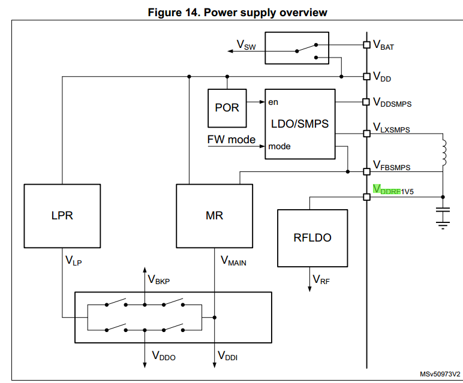

## 1.4 HSE32 TXCO

- XTAL HSE32 时钟的稳定性可能会受到 sub-GHz 无线电的影响，具体取决于发射输出功率（最大 +22 dBm），从而使设备发热。加热取决于所使用的发射输出功率和设备封装。必须采用热耗散技术进行仔细的 PCB 设计，以避免热量传递到 HSE32 参考时钟源。有关与 sub-GHz 无线电相关的 HSE32 频率漂移要求，请参阅第 4.5.1 节：LoRa 调制解调器。

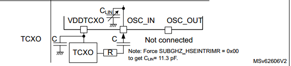

- 外部源(HSE32 TXCO) 在此模式下，必须提供外部TXCO 时钟源。
- 该外部源频率必须为 32 MHz。通过设置 RCC 时钟控制寄存器 (RCC_CR) 中的 HSEBYPPWR 和 HSEON 位来选择此模式。
- 占空比约为 45-55% 的外部时钟信号（正弦）
- OSC_IN 和 OSC_OUT 引脚：OSC_IN 引脚必须被驱动，而 OSC_IN 引脚必须被驱动。 OSC_OUT 引脚必须保持未连接状态。

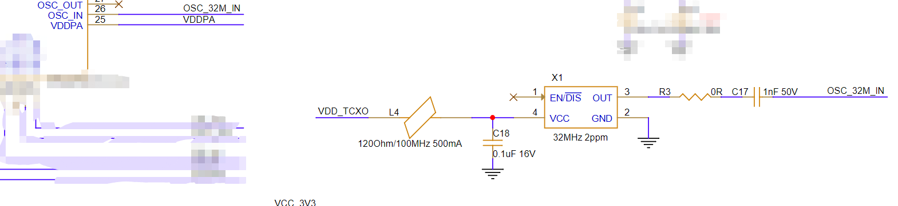

- 当 CPU 处于低功耗模式之一（停止、待机或关机）且 subGHz 无线电处于睡眠状态时，包括 TCXO 在内的 HSE32 时钟将被禁用

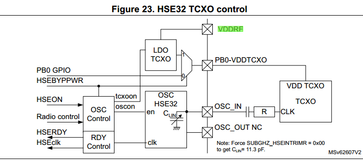

- 要使用 VDDTCXO，VDDRF 电源必须至少比所选 RegTcxoTrim 电压电平高 + 200 mV。

## 1.5 发送

### 1.5.1 Transmitter high output power

- 通过 RFO_HP RF 引脚支持高达 + 22 dBm 的传输高输出功率。为此，REG PA 必须直接由 VDDSMPS 引脚上的 VDD 供电

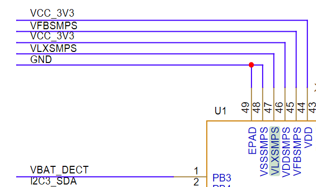

- SMPS 的使用是可选的。当不使用 SMPS 时，可以通过移除 VLXSMPS 和 VFBSMPS 引脚之间的线圈来减少 BOM

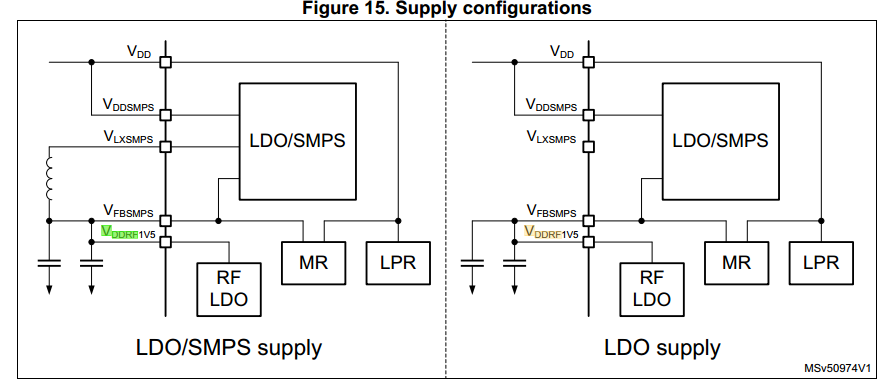

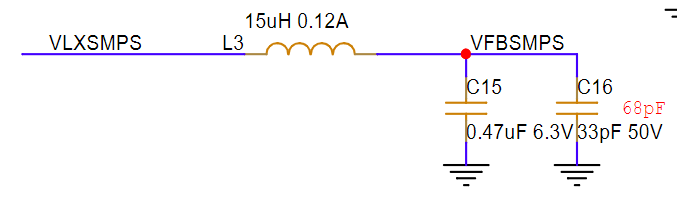

- 输出功率范围可按约 1 dB 的 32 个步长进行编程。功率放大器斜坡时序也是可编程的。这允许适应无线电调节要求。

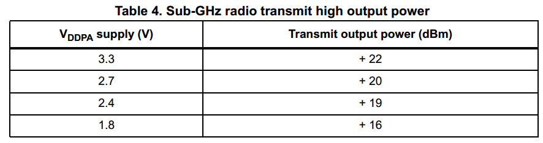

### 1.5.2 Transmitter low output power

- 通过 RFO_LP RF 引脚支持在整个 VDD 范围（1.8 至 3.6 V）上高达 + 15 dBm 的发射低输出功率。为此，REG PA 必须由 1.55 V 的稳压 VFBSMPS 电源供电。

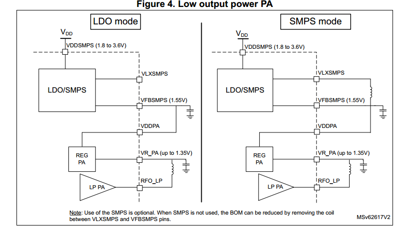

## 1.6 Receiver

- 接收链包括差分低噪声放大器 (LNA)、通过正交配置中的混频器操作实现低中频的下变频器。 I 和 Q 信号经过低通滤波，并由 ƩΔ ADC 将它们转换为数字域。在数字调制解调器中，信号被抽取、进一步下变频和信道滤波。解调是根据所选的调制方案完成的。

- 下混频至低 IF 是通过将接收信号与位于负频率的本地 RF-PLL 混频来完成的，其中 -flo = -frf + -fif。 （其中 flo 是本地 RF-PLL 频率，frf 是接收信号，fif 是中频）。所需信号位于 frf = flo + fif。

- 该接收器具有自动 I 和 Q 校准功能，可改善镜像抑制。校准在使用接收器之前启动时自动完成，并且可以通过命令请求。

## 1.7 锁相环RF-PLL

- RF-PLL 用作频率合成器，用于生成发送和接收链的本地振荡器频率 (flo)。 RF-PLL 使用自动校准并使用 32 MHz HSE32 参考。 Sub-GHz 无线电覆盖 150 至 960 MHz 范围内的所有连续频率

## 1.8 中频

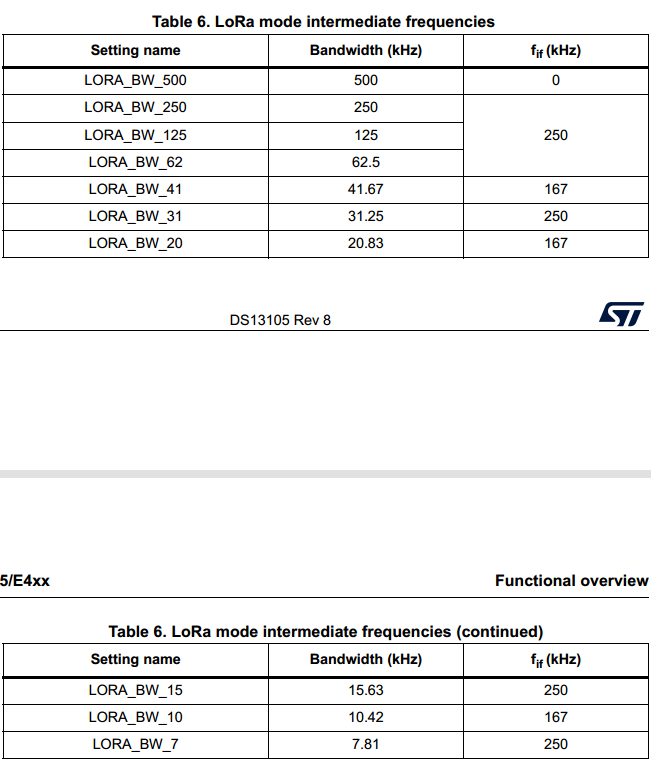

## 1.9 LoRa 调制解调器

- LoRa 调制解调器使用扩频调制和前向纠错技术来增加 1 GHz 以下无线电通信的范围和可靠性。 LoRa 调制解调器提供改进的同信道抑制。

- LoRa 调制可以通过 Set_ModulationParams() 命令针对给定应用进行优化，从而允许在链路预算、抗干扰性、频谱占用和标称数据速率之间进行权衡。

- 可以优化以下参数：
  - 扩频因子 (SF) 
  - 调制带宽 (BW) 
  - 误码率 (CR) 
  - 低数据速率优化 (LDRO) 
- LoRa 符号率 (Rs) 定义为 Rs = BW / 2SF
- 发射的信号是恒定包络信号。等效地，每 Hz 带宽每秒发送一个码片。

### 1.9.1 扩频因子 (SF)

- LoRa扩频调制是通过用多个信息码片表示数据包有效负载的每个数据位来执行的。发送扩展信息的速率称为符号率（Rs）。标称数据速率和码片速率之间的比率是扩频因子(SF)。它表示每个数据位的符号数。

- 链路的发送端和接收端必须事先知道扩频因子。

- 接收器输入端所需的最终信噪比 (SNR) 受到扩频因子的影响。这可以提高接收器灵敏度，从而增加链路预算和范围。

- 较高的扩频因子可提供更好的接收器灵敏度、更多的链路预算和更长的范围，但代价是更长的传输时间（见下表）。

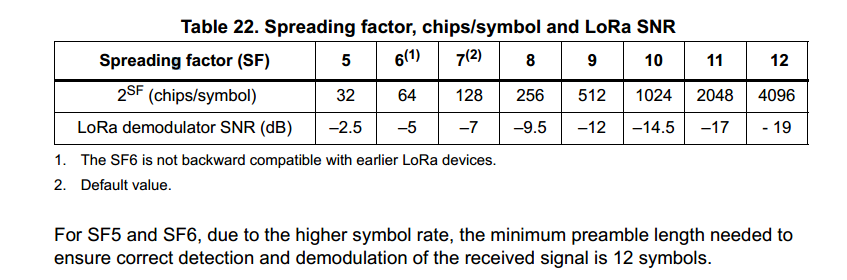

- SF它控制了chirp的速率，从而控制了数据传输的速度。每个符号可以编码SF个原始位1。例如，如果一个符号由1011111（代表十进制的95）组成，那么需要编码的原始位数就是7，因此扩频因子SF=7。

- Chips：在LoRa中，chip是最基本的信号单元。在一个给定的带宽内，chip的数量决定了数据的传输速率。chip的数量越多，数据传输速率越低，但是能够提供更好的抗干扰能力。

- `2SF (chips/symbol)`，那么就意味着一个符号包含``2^SF`个chips

### 1.9.2 带宽（BW）

- 信号带宽的增加允许使用更高的有效数据速率并减少传输时间，但代价是灵敏度降低、链路预算更少和范围更短。
- 对于允许的占用带宽存在依赖于国家/地区的监管限制。
- LoRa信号带宽是指双边带宽（DSB）。带宽选择范围如下表所示

### 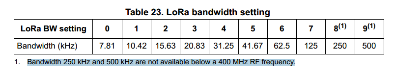1.9.3 前向纠错编码率（CR）

- 通过执行前向纠错可以提高sub-GHz无线电通信的可靠性。这在存在干扰的情况下特别有效。编码率可以响应于信道条件而改变。编码率信息包含在数据包标头中以供接收器使用。

- 较高的编码率可以提供更好的抗干扰能力，但代价是传输时间更长。在正常条件下，4 / 5 的系数提供了最佳权衡。在强干扰的情况下，可以使用较高的编码率。

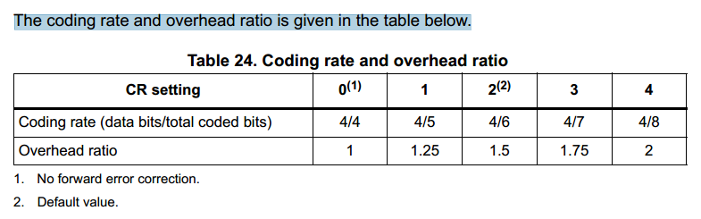

### 1.9.4 低数据速率优化 (LDRO)

- 对于低数据速率（通常是高 SF 或低 BW）和很长的有效负载（可能持续几秒），可以启用低数据速率优化 (LDRO)。这将每个符号的位数减少到给定的 SF 减 2，以允许接收器更好地跟踪 LoRa 接收信号。根据有效负载长度，当 LoRa 符号时间等于或高于 16.38 ms 时，通常建议采用低数据速率优化。

### 1.9.5 LoRa 帧

-  显式标头模式数据包：包括一个短标头，其中包含有关有效负载字节数、编码率和 CRC 存在的信息。
- 隐式报头模式数据包（无报头） 

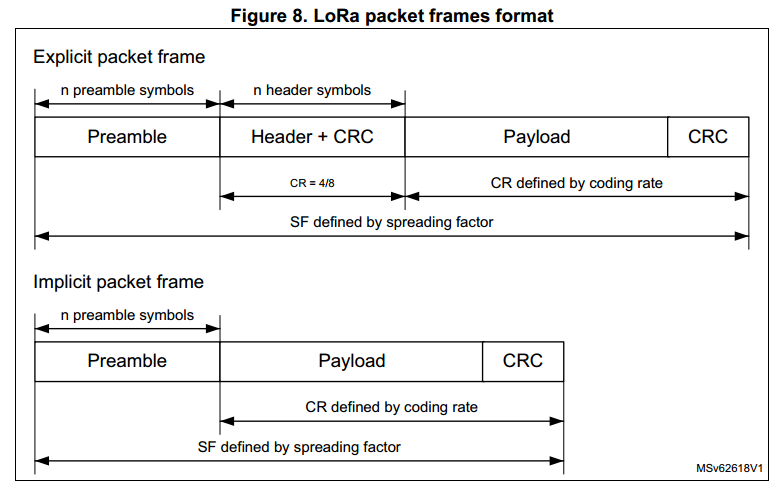

- **显式标头模式** 

  默认操作模式是显式标头模式，其中标头提供有关有效负载的信息。使用最大前向纠错编码率 4/8 传输标头。它受自己的标头 CRC 保护，允许接收方在接收到无效标头时丢弃数据包。

- **隐式标头模式**

  在有效负载编码率和CRC存在是固定的或预先已知的某些操作模式中，通过调用隐式标头模式来减少传输时间可能是有利的。在此模式下，数据包帧中不存在标头。必须在 sub-GHz 无线电链路的两侧配置有效负载长度、前向纠错编码率和有效负载 CRC 的存在。

### 1.9.6 LoRa 空中传播时间

- 数据包的总传输时间可计算如下： TotalTimeOnAir = (PreambleSymbols + NbSymbolPayload + 4.25 + 8) x (2SF/ BW) 
- 其中 PreambleSymbols 是 Set_PacketParams(PbLength) 中编程的前导码符号数。
- 有效负载符号的数量可以计算如下： NbSymbolPayload = CEILING(NbSymbolPayloadFrac,4 + CR) 其中 CEILING 是向上舍入到紧邻第一个小数参数的 (4 + CR) 整数倍的函数。
- 显示模式下有效负载小数符号的数量可计算如下： NbSymbolPayloadFrac = ((PL x 8 + CRC x 16 - 4 x (SF - 7)) x (4 + CR)) / (4 x SF)
- 隐式模式下有效负载小数符号的数量可计算如下： NbSymbolPayloadFrac = ((PL x 8 + CRC x 16 - 4 x (SF - 2)) x (4 + CR)) / (4 x SF) 
- 其中： 
  - CRC = 0（无 CRC）或 1（16 位 CRC）
  - CR = 0 至 4 • PL = 1 至 255，用户数据有效负载长度（以字节为单位
  - SF = 7 至 12 扩频因子 

原始数据速率= ((SF x BW) / 2SF) x (4 / (4 + CR)) 

实际数据速率= (PayloadLength x 8) / TotalTimeOnAir

### 1.9.7 通道活动检测 (CAD)
- 信道活动检测用于通过检测 LoRa 前导码或数据符号来检测 LoRa 信号的存在。
- 一旦进入通道活动检测模式，就会按照 Set_CadParams() 命令中设置的确定持续时间扫描频段。如果在此期间检测到 LoRa 符号，则设置检测到的通道活动 IRQ。
- 执行通道活动检测所需的时间取决于 LoRa 调制设置。对于给定的 SF/BW，典型的 CAD 检测时间可以选择为 1、2、4、8 或 16 个符号。 CAD持续时间进一步延长了半个符号。

## 1.10 Sub-GHz 无线电数据缓冲区
- Sub-GHz 无线电使用 256 字节 RAM 数据缓冲区，在**除睡眠和深度睡眠**之外的所有 Sub-GHz 无线电操作模式下，CPU 均可通过 SUBGHZSPI 接口访问该缓冲区。 RAM 数据缓冲区在深度睡眠模式下被清除，可以选择在睡眠模式下保留，并在所有其他模式下始终保留。在睡眠和深度睡眠模式下，TxBaseAddr 和 RxBaseAddr 值会丢失。为了在睡眠模式保留后检索数据，必须使用默认值（TxBaseAddr = 0x80 和 RxBaseAddr = 0x00），或者 RxPayloadLength 和 RxStartBufferPointer 必须存储在 CPU 内存中。

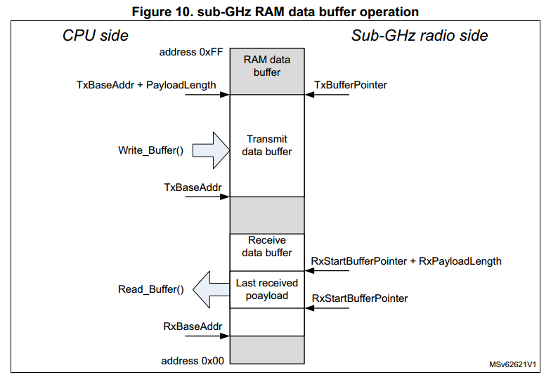

## 1.11 Sub-GHz 无线电操作模式
- Sub-GHz 无线电重置后，将启动启动阶段。由于在此阶段 BUSY 处于活动状态，因此无法接受命令。当 subGHz 无线电的电源和时钟可用时，BUSY 被停用，CPU 可以进行控制。在启动阶段之后，可以选择以下操作模式之一：

### 睡眠模式

- 深度睡眠：所有 sub-GHz 无线电时钟均关闭，数据存储器丢失 
- RC 13 MHz 时钟关闭 
- RC 64 kHz 和定时器可保持运行（可选） 

- 保留可选寄存器和数据存储器

- Set_Sleep() 命令后，Sub-GHz 无线电无法接收任何 SPI 命令。用户必须保证 sub-GHz 无线电 SPI NSS 在 500 μs 期间不会设置为低电平。

可以通过以下方式退出睡眠模式： • 根据通过 sub-GHz 无线电 SPI NSS 信号发出的固件请求（使 sub-GHz 无线电 SPI NSS 保持低电平至少 20 μs） • 根据来自 sub-GHz 无线电 RTC 定时器的请求，生成一个计数结束事件（对应于占空比操作） 当保留 sub-GHz 无线电配置寄存器时，退出休眠模式时会执行热启动。在热启动期间，配置寄存器将恢复其保留值，并跳过校准状态。

### 校准模式
### 待机模式
### 活动模式

### HSE32 待机模式

### 深度睡眠模式

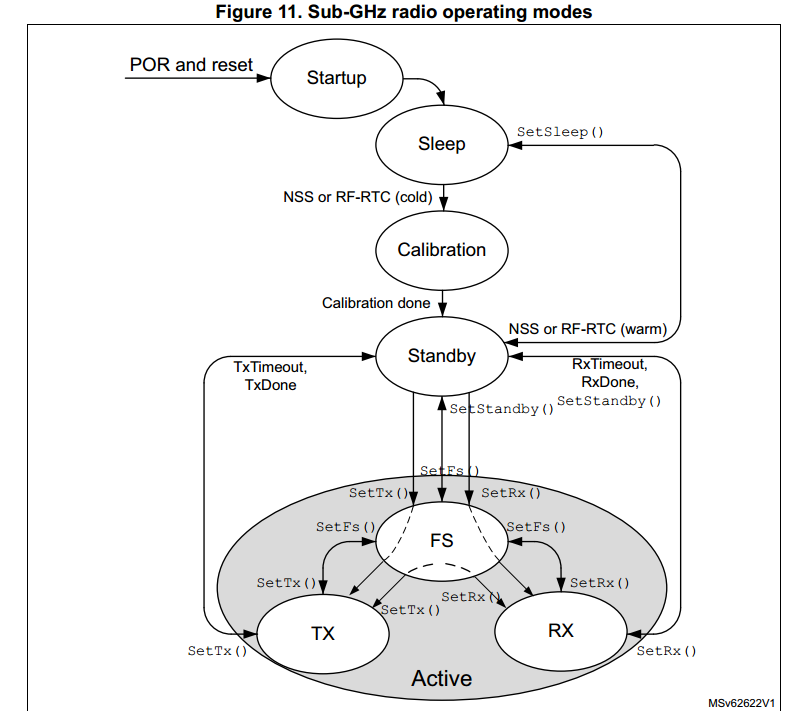

### 主动模式切换时间

- 所有写命令均激活 BUSY。对于读命令，BUSY 保持低电平。
- 切换时间 (tSWMODE) 定义为处理命令或达到稳定工作模式的时间，从 sub-GHz 无线电 SPI NSS 上升沿开始，结束 SPI 命令事务，直到 BUSY 变为非活动状态。在 1 GHz 以下无线电 SPI NSS 上升沿、结束 SPI 命令事务和设置 BUSY 之间有一个小的延迟 (tSW)。 tSW 的最长时间为 600 ns。

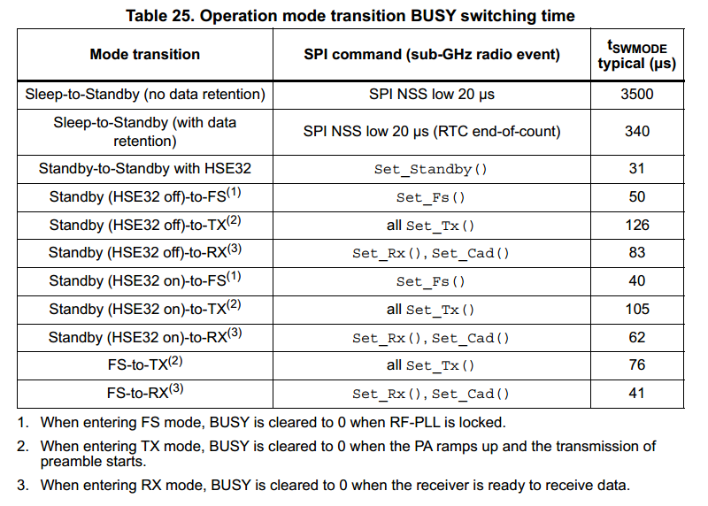

## 1.12 Sub-GHz 无线电 SPI 接口

- 对于每次访问，sub-GHz 无线电 SPI NSS 在传输开始时变低，并在所有字节传输完毕后在结束时设置为高。

支持以下事务类型： 

- 配置事务：为CPU 提供对控制寄存器的直接访问。

用于写入或读取 sub-GHz 无线电配置寄存器或缓冲存储器。

- 命令事务：需要更复杂的非原子操作，例如数据包传输和接收或操作模式更改 BUSY 用于指示 sub-GHz 无线电的状态及其接收 SPI 事务的能力（或不能力）。在发出新的 SPI 事务之前，CPU 必须检查 BUSY 状态，以确保 sub-GHz 无线电可以接收新的事务。

### Set_PaConfig() command

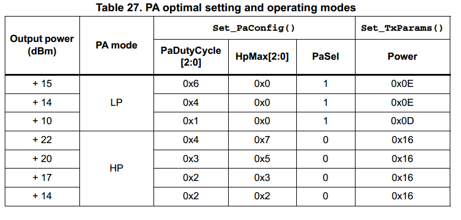

# 2. LORAWAN

## 2.1 初始化

- 引脚初始化: ANT_RX_CTRL ANT_TX_CTRL

  - RF_SW_CTRL3：这个引脚在所有的模式下都被设置为高电平（GPIO_PIN_SET），除了关闭射频开关的模式（RADIO_SWITCH_OFF）。

- SUBGHZ初始化

## 2.2 LoRaWAN_Init

- 初始化LmHandler `LmHandlerInit`
  - 注册回调函数
  - 初始化和激活标准协议包 `PACKAGE_ID_COMPLIANCE`
  - 如果启用`额外的LoRaWAN包`,则注册

应用层时钟同步（包ID：1，默认端口：202）
远程组播设置（包 ID：2，默认端口：200）
碎片数据块传输（包ID：3，默认端口：201）
固件管理协议（包 ID：4，默认端口：203）

- 初始化地区参数 `LoraInfo_Init`
  - 可根据不同地区进行配置
  - https://www.thethingsnetwork.org/docs/lorawan/frequency-plans/
  - https://docs.chirpwireless.io/LoRaWAN/frequencies/#n
  - 默认情况下启用一个地区占用ROM:3.08KB RAM:0.316KB

### 2.4 参数配置

- 配置地区,类型,ADR,数据速率,默认类,周期性ping槽,占空比控制
- 配置dev_eui,Join server EUI
- `LmHandlerConfigure`
  - LoRaMacInitialization
  - 如果数据保留可用，请尝试从备份 RAM 结构恢复上下文
  - 安全元件初始化 MCU ID

- 单通道模式配置
- 设置LoRaWAN通道掩码,发送速率, 发送功率,占空比
OTAA:Application root key,Network root key
ABP:Application session key,Network session key,DevAddr,NetworkID
- 设置接收窗口C通道
- 网络终端设备激活`MIB_NETWORK_ACTIVATION`

## 2.5 LoRaMac事件

https://stackforce.github.io/LoRaMac-doc/LoRaMac-doc-v4.7.0/index.html


>  一般来说，LoRaMAC层使用MCPS服务进行数据传输和接收，使用MLME服务对LoRaWAN网络进行管理。MIB负责保存重要的运行时信息，并保存LoRaMAC层的配置信息。
>
> `MCPS`（MAC Common Part Sublayer）：MAC公共部分子层 它主要负责数据的传输和接收
>
> MLME（MAC Layer Management Entity）：MAC层管理实体。它主要用于管理LoRaWAN网络。


LoRa所有上下行链路消息都会携带PHY载荷，PHY载荷以1字节MAC头(MHDR)开始，紧接着MAC载荷(MACPayload)，最后是4字节的MAC校验码(MIC)。

射频PHY层：
<table>
   <tr>
      <td>Preamble</td>
      <td>PHDR</td>
      <td>PHDR_CRC</td>
      <td bgcolor="#CCCCCC" >PHYPayload</td>
      <td>CRC</td>
   </tr>
</table>
图5.射频PHY结构(注意 CRC只有上行链路消息中存在)


PHY载荷：
<table>
   <tr>
      <td>MHDR</td>
      <td bgcolor="#CCCCCC" >MACPayload</td>
      <td>MIC</td>
   </tr>
</table>
或者
<table>
   <tr>
      <td>MHDR</td>
      <td bgcolor="#CCCCCC" >Join-Request</td>
      <td>MIC</td>
   </tr>
</table>
或者
<table>
   <tr>
      <td>MHDR</td>
      <td bgcolor="#CCCCCC" >Join-Response</td>
      <td>MIC</td>
   </tr>
</table>
### 2.5.1 LoRaMacInitialization

- 验证该地区是否受支持
- 确认队列重置
- 初始化模块上下文
- 重置为默认值
- 初始化地区的通道掩码和通道
- 初始化定时器 TxDelayedTimer,RxWindowTimer1,RxWindowTimer2,AckTimeoutTimer,RetransmitTimeoutTimer
- 存储当前初始化时间
- 初始化无线电驱动程序`RadioInit`
- 初始化安全元件驱动程序
- 初始化加密模块
- 初始化MAC命令模块(初始化链表)
- 随机种子初始化
- 启用执行请求

### 2.5.2 MAC IRQ 事件[查询处理]

- 事件通过不同中断回调设置赋值

#### 2.5.3.1 TxDone

- 不是CLASS C,发送后进入睡眠模式
- 设置RX窗口1,2定时器
- CLASS C或者ACK包,设置ACK超时定时器
- 设置`TimeCredits`
`TimeCredits`是一个关键的参数，它代表了在特定频带上可用的`时间信用`。在LoRa网络中，为了遵守无线电频谱的公平使用规则，每个频带都有一个称为“占空比”的限制。这是一个规定了设备在特定时间内可以发送多少数据的规则。TimeCredits就是用来跟踪和管理这个占空比的。具体来说，每当设备在一个频带上发送数据时，它就会消耗一些TimeCredits。这个消耗的数量取决于发送的数据量和频带的占空比。如果TimeCredits足够，那么数据就可以被发送。如果TimeCredits不足，那么设备就需要等待一段时间，直到TimeCredits积累到足够的数量。因此，TimeCredits的主要作用是帮助设备遵守无线电频谱的使用规则，确保公平、有效地使用无线电资源。这对于LoRa这种长距离、低功耗的无线通信技术来说，是非常重要的。

#### 2.5.3.2 RxDone

1. 进入睡眠
2. 如果在RX1接收完成,停止RX2定时器
3. 获取header数据并根据Mtype进行不同处理

```c
macHdr.Value = payload[pktHeaderLen++];
```
4. 验证我们是否需要禁用 AckTimeoutTimer

- 启用ACK请求,并且下行收到ACK,启用`OnAckTimeoutTimerEvent`
- CLASS C,启用`OnAckTimeoutTimerEvent`
- 用于结束ACK超时定时器

##### 2.5.2.1 FRAME_TYPE_JOIN_ACCEPT

1. size < `MHDR(1) + AppNonce(3) + NetID(3) + DevAddr(4) + DLSettings(1) + RxDelay(1) + MIC(4)` , 执行`PrepareRxDoneAbort`

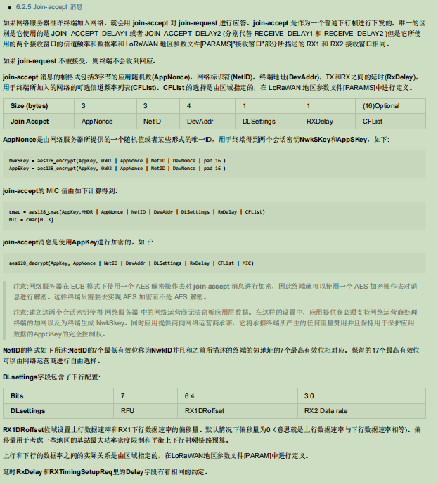

2. 如果接收到的窗口无效，不在RX1或者RX2则中止

3. 如果设备尚未连接，并且没有正在进行的重新连接请求，则中止

4. 获取EUI 设置EUI在`LmHandlerConfigure`设置

5. 处理加入接受消息。解密消息，验证 MIC，如果成功则派生会话密钥。

6. 解密成功,获取netid,devaddr,dlsettings,rxdelay,cfList(可选) 设置mask信道掩码等信息

7. MLME处理JOIN 验证请求是否在队列中并且处于活动状态  -> 设置元素状态JOIN成功  ->  否则设置JOIN失败


| **MType** | 描述 |
| --------- | ---- |
| 000       |Join Request|
| 001       |Join Accept|
| 010       |Unconfirmed Data Up|
| 011       |Unconfirmed Data Down|
| 100       |Confirmed Data Up|
| 101       |Confirmed Data Down|
| 110       |RFU|
| 111       |Proprietary|

发送Join Request为  `00 01002A00C024E124 3802089E8024E124 A966 B6CBFCB3`.join-request 消息不用加密

<table>
   <tr>
      <td><b>Size (bytes)</b></td>
      <td>8</td>
      <td>8</td>
     <td>2</td>
   </tr>
   <tr>
      <td><b>Join Request</b></td>
      <td>AppEUI</td>
      <td>DevEUI</td>
     <td>DevNonce</td>
   </tr>
</table>


join-request 消息包含了AppEUI 和 DevEUI ，后面还跟了2个字节的声明 DevNonce。


DevNonce 是一个随机值。网络服务器为每个终端记录过去的 DevNonce 数值，如果相同设备发出相同的 DevNonce 的join request就会忽略。


join-request 消息的MIC数值(见第4章 MAC帧格式)按照如下公式计算：


> cmac = aes128_cmac(AppKey, MHDR | AppEUI | DevEUI | DevNonce)
> MIC = cmac[0..3]

- MHDR: 00 -> Major:0 RFU:0 MType:0 Join Request
- AppEUI: 01002A00C024e124[小端] -> 24e124C0002A0001
- DevEUI: 3802089E8024e124[小端] -> 24e124809E082038
- DevNonce: A966
- MIC: B6CBFCB3


例如接收到的payload为`20 0000 1C0302 01B99EBC 06 08 01F604F8CF`.
注意:网络服务器在 ECB 模式下使用一个 AES 解密操作去对 join-accept 消息进行加密，因此终端就可以使用一个 AES 加密操作去对消息进行解密。这样终端只需要去实现 AES 加密而不是 AES 解密。

- MHDR: 20 -> Major:0 RFU:0 MType:2 Join Accept

<table>
   <tr>
      <td><b>Size (bytes)</b></td>
      <td>3</td>
      <td>3</td>
      <td>4</td>
      <td>1</td>
      <td>1</td>
      <td>(16)Optional</td>
   </tr>
   <tr>
      <td><b>Join Accpet</b></td>
      <td>AppNonce</td>
      <td>NetID</td>
      <td>DevAddr</td>
      <td>DLSettings</td>
      <td>RXDelay</td>
      <td>CFList</td>
   </tr>
</table>

**AppNonce**是由网络服务器所提供的一个随机值或者某些形式的唯一ID，用于终端得到两个会话密钥**NwkSKey**和**AppSKey**，如下:

    NwkSKey = aes128_encrypt(AppKey, 0x01 | AppNonce | NetID | DevNonce | pad 16 )
    AppSKey = aes128_encrypt(AppKey, 0x02 | AppNonce | NetID | DevNonce | pad 16 )

**join-accept**的 MIC 值由如下计算得到:

    cmac = aes128_cmac(AppKey,MHDR | AppNonce | NetID | DevAddr | DLSettings | RxDelay | CFList) 
    MIC = cmac[0..3]

**join-accept**消息是使用**AppKey**进行加密的，如下:

    aes128_decrypt(AppKey, AppNonce | NetID | DevAddr | DLSettings | RxDelay | CFList | MIC) 

> 注意:网络服务器在 ECB 模式下使用一个 AES 解密操作去对 **join-accept** 消息进行加密，因此终端就可以使用一个 AES 加密操作去对消息进行解密。这样终端只需要去实现 AES 加密而不是 AES 解密。

> 注意:建立这两个会话密钥使得 网络服务器 中的网络运营商无法窃听应用层数据。在这样的设置中，应用提供商必须支持网络运营商处理终端的加网以及为终端生成 NwkSkey。同时应用提供商向网络运营商承诺，它将承担终端所产生的任何流量费用并且保持用于保护应用数据的AppSKey的完全控制权。

**NetID**的格式如下所述:**NetID**的7个最低有效位称为**NwkID**并且和之前所描述的终端的短地址的7个最高有效位相对应。保留的17个最高有效位可以由网络运营商进行自由选择。

**DLsettings**字段包含了下行配置:

<table>
   <tr>
      <td><b>Bits</b></td>
      <td>7</td>
      <td>6:4</td>
      <td>3:0</td>
   </tr>
   <tr>
      <td><b>DLsettings</b></td>
      <td>RFU</td>
      <td>RX1DRoffset</td>
      <td>RX2 Data rate</td>
   </tr>
</table>

**RX1DRoffset**位域设置上行数据速率和RX1下行数据速率的偏移量。默认情况下偏移量为0（意思就是上行数据速率与下行数据速率相等)。偏移量用于考虑一些地区的基站最大功率密度限制和平衡上下行射频链路预算。

上行和下行的数据率之间的实际关系是由区域指定的，在LoRaWAN地区参数文件[PARAM]中进行定义。

延时**RxDelay**和**RXTimingSetupReq**里的**Delay**字段有着相同的约定。

##### 2.5.2.2 FRAME_TYPE_DATA_CONFIRMED_DOWN

- McpsIndication = MCPS_CONFIRMED;
- 转入`FRAME_TYPE_DATA_UNCONFIRMED_DOWN1`

##### 2.5.2.3 FRAME_TYPE_DATA_UNCONFIRMED_DOWN

1. `LoRaMacParserData`解析数据,错误退出
2. `DetermineFrameType`确定帧类型

> 对网络管理者而言，有一套专门的MAC命令用来在服务器和终端MAC层之间交互。这套MAC命令对应用程序或者应用服务器或者运行在终端设
>
> 备上的应用程序是不可见的。
>
> 单个数据帧中可以包含MAC命令序列，要么在FOpts字段中捎带，要么作为独立帧将**FPort**设成0后放在FRMPayload里。如果采用FOpts捎带的
>
> 方式，MAC命令不进行加密并且长度不能超过15字节。如果采用独立帧放在**FRMPayload**的方式，那就必须采用加密方式，并且不能超过
>
> **FRMPayload**的最大长度。

```c
	/* LoRaWAN规范允许几种可能的配置，如何建立数据上行/下行帧。为了清楚起见，应用了以下命名。请记住，这是特定于实现，因为在LoRaWAN规范中没有包含定义。
     *
     * X -> 字段可用
     * - -> 字段不可用
     *
     * +-------+  +----------+------+-------+--------------+
     * | FType |  | FOptsLen | Fopt | FPort |  FRMPayload  |
     * +-------+  +----------+------+-------+--------------+
     * |   A   |  |    > 0   |   X  |  > 0  |       X      |
     * +-------+  +----------+------+-------+--------------+
     * |   B   |  |   >= 0   |  X/- |   -   |       -      |
     * +-------+  +----------+------+-------+--------------+
     * |   C   |  |    = 0   |   -  |  = 0  | MAC commands |
     * +-------+  +----------+------+-------+--------------+
     * |   D   |  |    = 0   |   -  |  > 0  |       X      |
     * +-------+  +----------+------+-------+--------------+
     */
```

1. 检查是否是组播消息 -> 根据组播下行异常过滤报文
2. 获取最大允许计数器差异,用于获取下行帧计数器值
3. 解密消息
4. 移除MAC命令
5. 根据`fType`帧类型进行处理

###### 2.5.2.3.1 FRAME_TYPE_A

```c
/* +----------+------+-------+--------------+
* | FOptsLen | Fopt | FPort |  FRMPayload  |
* +----------+------+-------+--------------+
* |    > 0   |   X  |  > 0  |       X      |
* +----------+------+-------+--------------+
*/
```

- 解码MAC命令在FOpts字段 进行处理

###### 2.5.2.3.2 FRAME_TYPE_B

```c
/* +----------+------+-------+--------------+
* | FOptsLen | Fopt | FPort |  FRMPayload  |
* +----------+------+-------+--------------+
* |    > 0   |   X  |   -   |       -      |
* +----------+------+-------+--------------+
*/
```

- 解码MAC命令在FOpts字段 进行处理

###### 2.5.2.3.3 FRAME_TYPE_C

```c
/* +----------+------+-------+--------------+
 * | FOptsLen | Fopt | FPort |  FRMPayload  |
 * +----------+------+-------+--------------+
 * |    = 0   |   -  |  = 0  | MAC commands |
 * +----------+------+-------+--------------+
 */
```

- 解码FRMPayload中的MAC命令

###### 2.5.2.3.4 FRAME_TYPE_D

```c
/* +----------+------+-------+--------------+
 * | FOptsLen | Fopt | FPort |  FRMPayload  |
 * +----------+------+-------+--------------+
 * |    = 0   |   -  |  > 0  |       X      |
 * +----------+------+-------+--------------+
 */
```

- 没有 MAC 命令，只有应用程序负载

##### 2.5.3.2.4 FRAME_TYPE_PROPRIETARY

- LoRaMAC专有框架
- 处理接收到的数据，将有效载荷复制到指定的缓冲区，并设置相关的状态和指示。

#### 2.5.3.3 TxTimeout

- 非CLASS C,发送后进入睡眠模式
- 更新`RxSlot`
- 设置确认队列元素为超时
调用`LoRaMacConfirmQueueSetStatusCmn`函数主要是为了更新LoRaWAN协议栈中的确认队列的状态。在LoRaWAN通信中，确认队列用于存储待确认的消息。每当有新的消息需要发送或接收时，都会在确认队列中添加一个元素。
以下是一些可能需要调用此函数的情况：
1. 当设备发送一个需要确认的消息时，会在确认队列中添加一个元素，并将其状态设置为待确认。
2. 当设备接收到一个确认消息时，会找到确认队列中对应的元素，并将其状态更新为已确认。
3. 当设备需要重发一个消息时，会找到确认队列中对应的元素，并将其状态更新为待重发。

#### 2.5.3.4 RxError && RxTimeout

- HandleRadioRxErrorTimeout
- `非CLASSB`在RX1发生错误,ACK状态修改为超时或错误,为队列中的所有元素设置公共状态;经过时间超过RX2接收窗口,停止RX2定时器
- RX2发生错误同逻辑处理
- 更新`RxSlot`状态

### 2.5.4 MacDone

1. 关闭Request handing,不允许执行Request
2. 清除`MacState`的``RX_ABORT`和`TX_RUNNING`
3. 存在MLME 和 MCPS请求 -> 验证信标获取 MLME 请求是否处于待处理状态
   1. noTx -> 执行`LoRaMacHandleMlmeRequest`和`LoRaMacHandleMcpsRequest`
   2. 执行

```c
LoRaMacHandleRequestEvents( );
LoRaMacHandleScheduleUplinkEvent( );
LoRaMacEnableRequests( LORAMAC_REQUEST_HANDLING_ON );
```

4. LoRaMacHandleIndicationEvents

#### 2.5.4.1 LoRaMacHandleMlmeRequest

1. 验证``JOIN``是在队列中并且处于活动状态。
   1. 节点加入成功 -> 上行链路消息重复计数器清零
   2. 清除MACStae 的 TX_RUNNING
2. 没有JOIN -> 存在`MLME_TXCW`或`MLME_TXCW1`清除TX_RUNNING

#### 2.5.4.2 LoRaMacHandleMcpsRequest

1. `MacState` = `LORAMAC_IDLE`才执行
2. 具有`McpsReq` -> 执行 `McpsConfirm`

- 复制信息从`mcpsConfirm`到`TxParams`
- 执行`OnTxData`回调

3. 具有`MlmeReq` -> 执行`MlmeConfirm`

#### 2.5.4.3 LoRaMacHandleScheduleUplinkEvent

#### 2.5.4.4 LoRaMacHandleIndicationEvents

1. MacMlmeIndication
2. MacMcpsIndication

### 2.5.5 LoRaMacParser

#### 2.5.5.1 LoRaMacParserData

图6.PHY载荷结构


MAC载荷：
<table>
   <tr>
      <td bgcolor="#CCCCCC" >FHDR</td>
      <td>FPort</td>
      <td>FRMPayload</td>
   </tr>
</table>
图7.MAC载荷结构


FHDR：
<table>
   <tr>
      <td>DevAddr</td>
      <td>FCtrl</td>
      <td>FCnt</td>
      <td>FOpts</td>
   </tr>
</table>


- FHDR是由终端短地址(DevAddr)、1字节帧控制字节(FCtrl)、2字节帧计数器(FCnt)和用来传输MAC命令的帧选项(FOpts，最多15个字节)组成。

<table>
   <tr>
      <td><b>Size(bytes)</b></td>   
      <td>4</td>
      <td>1</td>
      <td>2</td>
	  <td>0..15</td>
   </tr>
   <tr>
      <td><b>FHDR</b></td>   
      <td>DevAddr</td>
      <td>FCtrl</td>
      <td>FCnt</td>
	  <td>FOpts</td>
   </tr>
</table>
FCtrl在上下行消息中有所不同，下行消息如下：

<table>
   <tr>
      <td><b>Bit#</b></td>   
      <td>7</td>
      <td>6</td>
      <td>5</td>
	  <td>4</td>
	  <td>[3..0]</td>
   </tr>
   <tr>
      <td><b>FCtrl bits</b></td>   
      <td>ADR</td>
      <td>ADRACKReq</td>
      <td>ACK</td>
	  <td>FPending</td>
	  <td>FOptsLen</td>
   </tr>
</table>
上行消息如下：

<table>
   <tr>
      <td><b>Bit#</b></td>   
      <td>7</td>
      <td>6</td>
      <td>5</td>
	  <td>4</td>
	  <td>[3..0]</td>
   </tr>
   <tr>
      <td><b>FCtrl bits</b></td>   
      <td>ADR</td>
      <td>ADRACKReq</td>
      <td>ACK</td>
	  <td bgcolor="#CCCC00" >RFU</td>
	  <td>FOptsLen</td>
   </tr>
</table>


- 如果帧载荷字段不为空，端口字段必须体现出来。端口字段有体现时，若FPort的值为0表示FRMPayload只包含了MAC命令；具体见章节4.4中的MAC命令。  FPort的数值从1到223(0x01..0xDF)都是由应用层使用。  FPort的值从224到255(0xE0..0xFF)是保留用做未来的标准应用拓展。

<table>
   <tr>
      <td><b>Size(bytes)</b></td>   
      <td>7..23</td>
      <td>0..1</td>
      <td>0..N</td>
   </tr>
   <tr>
      <td><b>MACPayload</b></td>   
      <td>FHDR</td>
      <td>FPort</td>
      <td>FRMPayload</td>
   </tr>
</table>

N是应用程序载荷的字节个数。N的有效范围具体在第7章有定义。

N应该小于等于：
N <= M - 1 - (FHDR长度)
M是MAC载荷的最大长度。

### 2.5.6 ProcessMacCommands

<table>
   <tr>
      <td rowspan="2" ><b>CID</b></td>
      <td rowspan="2" ><b>Command</b></td>
      <td colspan="2" ><b>由谁发送</b></td>
      <td rowspan="2" ><b>描述</b></td>
   </tr>
   <tr>
      <td>终端</td>
      <td>网关</td>
   </tr>
   <tr>
      <td>0x02</td>
      <td>LinkCheckReq</td>
      <td>x</td>
      <td></td>
      <td>终端利用这个命令来判断网络连接质量</td>
   </tr>
   <tr>
      <td>0x02</td>
      <td>LinkCheckAns</td>
      <td></td>
      <td>x</td>
      <td>LinkCheckReq的回复。包含接收信号强度，告知终端接收质量</td>
   </tr>
   <tr>
      <td>0x03</td>
      <td>LinkADRReq</td>
      <td></td>
      <td>x</td>
      <td>向终端请求改变数据速率，发射功率，重传率以及信道</td>
   </tr>
   <tr>
      <td>0x03</td>
      <td>LinkADRAns</td>
      <td>x</td>
      <td></td>
      <td>LinkADRReq的回复。</td>
   </tr>
   <tr>
      <td>0x04</td>
      <td>DutyCycleReq</td>
      <td></td>
      <td>x</td>
      <td>向终端设置发送的最大占空比。</td>
   </tr>
   <tr>
      <td>0x04</td>
      <td>DutyCycleAns</td>
      <td>x</td>
      <td></td>
      <td>DutyCycleReq的回复。</td>
   </tr>
   <tr>
      <td>0x05</td>
      <td>RXParamSetupReq</td>
      <td></td>
      <td>x</td>
      <td>向终端设置接收时隙参数。</td>
   </tr>
   <tr>
      <td>0x05</td>
      <td>RXParamSetupAns</td>
      <td>x</td>
      <td></td>
      <td>RXParamSetupReq的回复。</td>
   </tr>
   <tr>
      <td>0x06</td>
      <td>DevStatusReq</td>
      <td></td>
      <td>x</td>
      <td>向终端查询其状态。</td>
   </tr>
   <tr>
      <td>0x06</td>
      <td>DevStatusAns</td>
      <td>x</td>
      <td></td>
      <td>返回终端设备的状态，即电池余量和链路解调预算。</td>
   </tr>
   <tr>
      <td>0x07</td>
      <td>NewChannelReq</td>
      <td></td>
      <td>x</td>
      <td>创建或修改 1个射频信道 定义。</td>
   </tr>
   <tr>
      <td>0x07</td>
      <td>NewChannelAns</td>
      <td>x</td>
      <td></td>
      <td>NewChannelReq的回复。</td>
   </tr>
   <tr>
      <td>0x08</td>
      <td>RXTimingSetupReq</td>
      <td></td>
      <td>x</td>
      <td>设置接收时隙的时间。</td>
   </tr>
   <tr>
      <td>0x08</td>
      <td>RXTimingSetupAns</td>
      <td>x</td>
      <td></td>
      <td>RXTimingSetupReq的回复。</td>
   </tr>
   <tr>
      <td>0x09</td>
      <td>TxParamSetupReq</td>
      <td></td>
      <td>x</td>
      <td>网络服务器用于设置基于当地规定的终端的最大允许驻留时间和最大EIRP</td>
   </tr>
   <tr>
      <td>0x09</td>
      <td>TxParamSetupAns</td>
      <td>x</td>
      <td></td>
      <td>TxParamSetupReq的回复。</td>
   </tr>
   <tr>
      <td>0x0A</td>
      <td>DlChannelReq</td>
      <td></td>
      <td>x</td>
      <td>通过从上行链路频率移位下行链路频率（即创建非对称信道）来修改下行链路RX1无线电信道的定义</td>
   </tr>
   <tr>
      <td>0x0A</td>
      <td>DlChannelAns</td>
      <td>x</td>
      <td></td>
      <td>DlChannelReq的回复。</td>
   </tr>
   <tr>
      <td>0x80~0xFF</td>
      <td>私有</td>
      <td>x</td>
      <td>x</td>
      <td>给私有网络命令拓展做预留。</td>
   </tr>
</table>
表4：MAC命令表

#### 2.5.6.1 SRV_MAC_RESET_CONF 0x01

#### 2.5.6.2 SRV_MAC_LINK_CHECK_ANS 0x02

- LinkCheckReq的回复。包含接收信号强度，告知终端接收质量
- 设置DemodMargin Demodulation margin. Contains the link margin [dB] of the last
- 设置NbGateways  收到最后一次 LinkCheckReq 的网关数量

通过LinkCheckReq命令，终端可以知道是否已连接上服务器。该命令没有载荷。

当网络服务器通过一个或者多个网关接收到LinkCheckReq命令时，它会以LinkCheckAns命令进行回复。

<table>
   <tr>
      <td><b>Size (bytes)</b></td>   
      <td>1</td>   
      <td>1</td>  
   </tr>
   <tr>
      <td><b>LinkCheckAns Payload</b></td>
      <td>Margin</td>
      <td>GwCnt</td>
   </tr>
</table>

解调预算(**Margin**)是一个范围为0~254的8位无符号整数，表示成功接收最新的**LinkCheckReq**命令的链路预算(单位为dB)。若 Margin 值为"0"则意味着数据帧是在解调水平上进行接收(0 dB或者没有预算)，当 Margin 值为"20"时则意味着数据帧到达在解调水平之上20dB的网关。

网关计数(**GwCnt**)是成功接收最新的**LinkCheckReq**命令的网关个数。

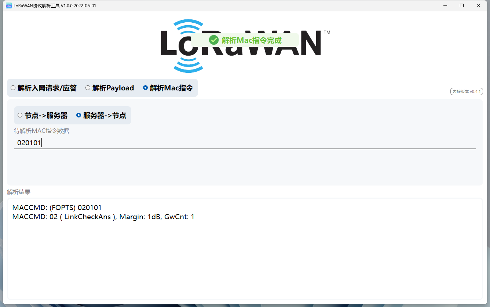

- 该命令可以用于确认是否与网关保持连接

#### 2.5.6.3 SRV_MAC_LINK_ADR_REQ 0x03

- 根据地区处理ADR请求
- 成功则进行`MOTE_MAC_LINK_ADR_ANS`MAC发送

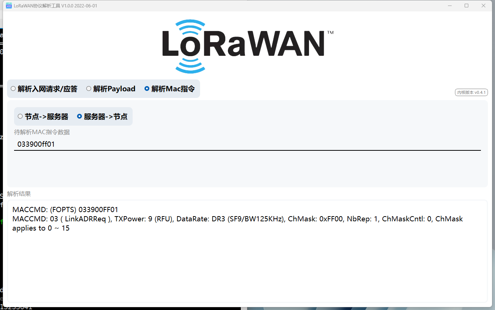

#### 2.5.6.4 接收窗口参数 SRV_MAC_RX_PARAM_SETUP_REQ 0x05

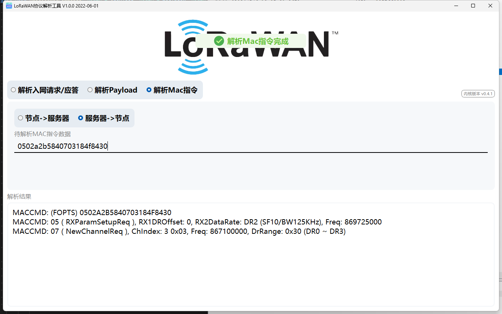

#### 2.5.6.7 信道的创建和修改 SRV_MAC_NEW_CHANNEL_REQ 0x07

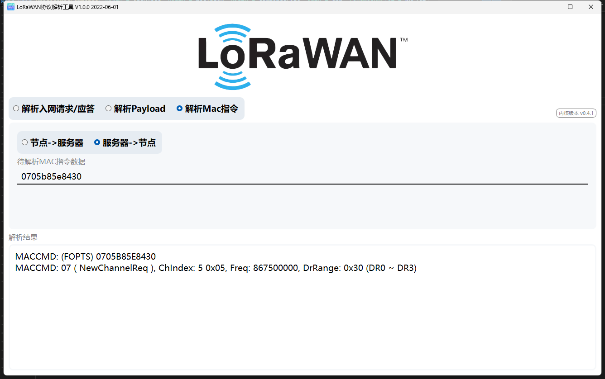

#### 2.5.6.11 SRV_MAC_DEVICE_TIME_ANS 0x0D

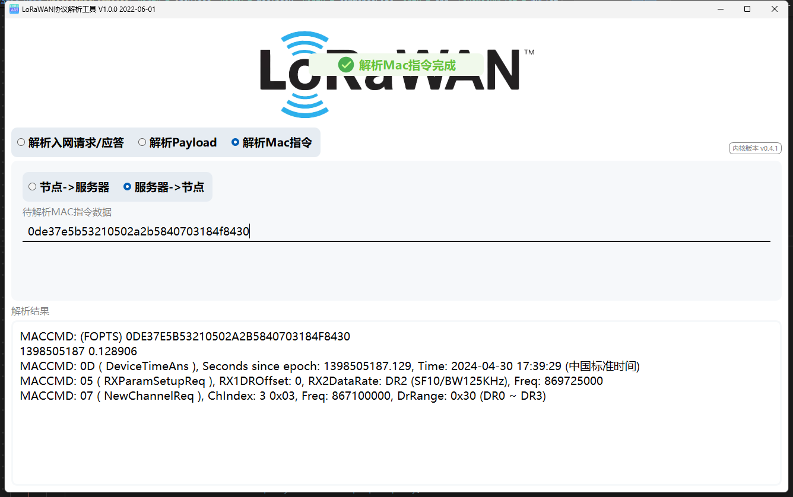

#### 2.5.6.4 其他未使用

### 2.5.7 MACState

```c
/*!
 * LoRaMac internal states
 */
enum eLoRaMacState
{
    LORAMAC_IDLE          = 0x00000000,
    LORAMAC_STOPPED       = 0x00000001,
    LORAMAC_TX_RUNNING    = 0x00000002,
    LORAMAC_RX            = 0x00000004,
    LORAMAC_ACK_RETRY     = 0x00000010,
    LORAMAC_TX_DELAYED    = 0x00000020,
    LORAMAC_TX_CONFIG     = 0x00000040,
    LORAMAC_RX_ABORT      = 0x00000080,
};
```

#### 2.5.7.1 IDLE

0. 由`LoRaMacStart`触发,
1. 在`LoRaMacProcess`中当`MacDone`==1时
   1. `LoRaMacHandleRequestEvents`中,更新req事件,执行`McpsConfirm`,`MlmeConfirm`
   2. `LoRaMacHandleScheduleUplinkEvent`中,执行设置mlme调度上行链路指示
2. `MacDone==1`的触发情况为触发了`LoRaMacHandleIrqEvents`中判断;
3. `macdone`//MAC循环完成标志

#### 2.5.7.2 STOPPED

1. 由`LoRaMacStop`触发
2. `LoRaMacInitialization`时设置为`STOP`

#### 2.5.7.3 TX_RUNNING

- 触发
  1. 发送过程
  2. `SendFrameOnChannel`
  3. `SetTxContinuousWave` `SetTxContinuousWave1`

- 清除
  1. `MacDone == 1` 后执行
    1. `MlmeRequest`
    2. `LoRaMacCheckForBeaconAcquisition`
    3. `LoRaMacCheckForRxAbort`
  2. `StopRetransmission`

#### 2.5.7.4 LORAMAC_TX_DELAYED

- 触发
  1. `ScheduleTx`中选择频道失败原因为`LORAMAC_STATUS_DUTYCYCLE_RESTRICTED`时

- 清除
  1. `LoRaMacHandleIndicationEvents` 中 `stopRetransmission == 1`时
  2. `OnTxDelayedTimerEvent`


#### 2.5.7.5 LORAMAC_RX_ABORT

- 触发
  1. `PrepareRxDoneAbort`

- 清除
  1. `LoRaMacCheckForRxAbort`

#### 2.5.7.6 其他

### 2.5.8 LoRaMacIsBusy

```
    if( ( MacCtx.MacState == LORAMAC_IDLE ) &&
        ( MacCtx.AllowRequests == LORAMAC_REQUEST_HANDLING_ON ) )
    {
        return false;
    }
    return true;
```


## 2.6 Radio事件

### 2.6.1 初始化

- 注册回调事件
- RadioInit
  
  - SUBGRF_Init
    - SMPS 时钟检测启用
    - 将默认 SMPS 当前驱动器设置为默认
    - MX_SUBGHZ_Init
    - 将radio置于待机模式
    - 初始化 TCXO 控制:  校准给定的无线电块
    - 初始化IO引脚
  
  - 设置电源调节器工作模式
  - RadioSleep
  - 初始化定时器 TxTimeoutTimer,RxTimeoutTimer,TxTimeoutTimer,RxTimeoutTimer
### 2.6.2 RadioIrq

#### 2.6.2.2 IRQ_TX_DONE

- 停止TX超时定时器
- 设置radio为待机模式
- 执行回调函数TxDone `MacCtx.RadioEvents.TxDone `
MacCtx.RadioEvents.TxDone
- MacProcessNotify [暂无使用]
- 发送完成钩子函数，用于TxTimeout异常容错机制

#### 2.6.2.3 IRQ_RX_DONE

- 停止RX超时定时器
- 不是连续接收(CLASS C)
  - 设置radio为待机模式
  - 隐式标头模式下的意外超时行为解决
- 读取收到的有效负载和数据包状态[Rssi,Snr.SignalRssi.FreqError]
- 执行回调函数RxDone `MacCtx.RadioEvents.RxDone `

#### 2.6.2.7 IRQ_HEADER_ERROR

- RxTimeout

#### 2.6.2.11 IRQ_RX_TX_TIMEOUT

- RxTimeout
- TxTimeout

#### 2.6.2.8 IRQ_CRC_ERROR

- RxError

#### 2.6.2.4 IRQ_PREAMBLE_DETECTED

- PRE OK
- 当检测到前导码时，超时将停止，并且必须使用等于 2 × RxPeriod + SleepPeriod 的值重新启动。

#### 2.6.2.5 IRQ_SYNCWORD_VALID

- SYNC OK

#### 2.6.2.6 IRQ_HEADER_VALID

- HDR OK

#### 2.6.2.9 (通道活动检测)IRQ_CAD_CLEAR| IRQ_CAD_DETECTED

### 2.6.3 SubGHz IRQ Handler

- 容错机制
  - 进入中断,中断触发源都为0,认为异常
  - 1000次异常,关闭中断,发送错误标志
- 正常只进行中断回调处理

## 2.7 LmHandler

1. LmHandlerInit 初始化
2. LmHandlerProcess 执行 mac处理 和 包管理任务

### 2.7.1 package

#### 2.7.1.1 Register

- 使用工厂模式设计思想,进行分层:https://www.runoob.com/design-pattern/factory-pattern.html
- 参考 [LoRaWAN_Init](#2.2 LoRaWAN_Init)

> - PACKAGE_ID_CLOCK_SYNC：这是时钟同步功能包。这个功能包提供了一种应用层消息包，可以通过LoRaWAN®将终端设备的实时时钟与网络时间同步，精度接近秒。这对于没有其他准确时间源的终端设备非常有用。
> - PACKAGE_ID_REMOTE_MCAST_SETUP：这是远程多播设置功能包。这个功能包定义了一种应用层消息包，允许在一组终端设备中编程一个多播分发窗口，并且临时启用Class B或Class C，然后将它们恢复到原始操作。
> - PACKAGE_ID_FRAGMENTATION：这是数据块分片传输功能包。这个功能包提供了一种应用层消息包，可以在LoRaWAN®上创建和管理分片传输会话，并向一个或多个终端设备发送一个分片的数据块。
> - PACKAGE_ID_FIRMWARE_MANAGEMENT：这是固件管理功能包。这个文档指定了固件和硬件版本管理，设备在给定时间重启以及固件升级图像管理的命令。

#### 2.7.12.2 Compliance 实现 LoRa-Alliance 认证协议处理


#### 2.7.1.3 ClockSync

#### 2.7.1.4 RemoteMcastSetup

#### 2.7.1.5 Fragmentation

#### 2.7.12.6 FirmwareManagement

### 2.7.2 LmHandlerSend

1. 执行验证
2. `LoRaMacMcpsRequest` -> `Send` -> `ScheduleTx`


# 3. module lora

## 3.1 subghz_error
- 触发机制:SubGHz IRQ 异常;LoRaMacTxTimeout

- 重载subghz模块3次失败,重启设备
- 进行3次尝试LoRaMacStop
- LoRaMacHandleMcpsRequest中`Stop retransmission`

```c
if(g_subghz_error) {
    LoRaMacStatus_t ret = LORAMAC_STATUS_ERROR;
    uint8_t timeout = 3;

    if(g_subghz_error == 1) {
        LoRaMacAbortProcess();
        g_subghz_error++;
        return;
    } else if(g_subghz_error < 10) {
        g_subghz_error++;
        return;
    }

    g_subghz_error = 0;
    s_subghz_error_count++;

    lora_printf("===subghz reinit[%lu] ...\r\n", s_subghz_error_count);

    if(s_subghz_error_count > 3) {
        s_subghz_error_count = 0;
        device_restart();
    }

    while(timeout--) {
        ret = LoRaMacStop();
        if(ret == LORAMAC_STATUS_OK) {
            break;
        }
        HAL_Delay(1000);
    }

    UTILS_ENTER_CRITICAL_SECTION();

    __HAL_RCC_SUBGHZ_FORCE_RESET();
    __HAL_RCC_SUBGHZ_RADIO_FORCE_RESET();

    for(uint16_t i = 0; i < 1000; i++) {
        __NOP();
    }

    __HAL_RCC_SUBGHZ_RELEASE_RESET();
    __HAL_RCC_SUBGHZ_RADIO_RELEASE_RESET();

    HAL_SUBGHZ_DeInit(&hsubghz);

    if(ret != LORAMAC_STATUS_OK) {
        HAL_SUBGHZ_Init(&hsubghz);
        s_lora_reload = true;
    } else {
        LoRaMacClassBHaltBeaconing();
        LoRaMacRadioReinit();
        LoRaMacStart();
        LoRaMacClassBResumeBeaconing();
        unxx_lora_insert_data(s_lora_buf.data, s_lora_buf.length, s_lora_buf.port, s_lora_buf.confirm);
    }

    UTILS_EXIT_CRITICAL_SECTION();
}
```
## 3.2 状态机

### 3.2.1 DEVICE_STATE_START
1. lora 重载后设置为`DEVICE_STATE_START`
2. OTAA入网成功后设置为`DEVICE_STATE_START`

- `DEVICE_STATE_START`状态下
  1. 查询入网状态
  2. 成功入网后设置为`DEVICE_STATE_SEND`
  3. 未入网则设置为`DEVICE_STATE_JOIN`

### 3.2.2 DEVICE_STATE_JOIN
1. ACTIVATION_TYPE_ABP -> `LmHandlerJoin`入网 -> 转入`DEVICE_STATE_SEND`
2. ACTIVATION_TYPE_OTAA -> `LmHandlerJoin`入网 -> 转入`DEVICE_STATE_CYCLE`

### 3.2.3 DEVICE_STATE_CYCLE
1. OTAA Join成功后设置为`DEVICE_STATE_CYCLE`
2. 发送后设置为`DEVICE_STATE_CYCLE`

- 设置为`DEVICE_STATE_SLEEP`
  1. 未入网
    - 执行重新入网流程
  2. 未发送数据
    - 执行重新发送数据流程

### 3.2.4 DEVICE_STATE_SLEEP
- 进入低功耗

### 3.2.5 DEVICE_STATE_SEND
1. 从队列获取数据
2. 链路检测机制
3. 发送数据

# 4.CLASS B
## 4.1 初始化
1. 注册回调函数
2. 初始化定时器 `BeaconTimer` `PingSlotTimer` `MulticastSlotTimer`
3.

## 4.2 Process
### 4.2.1 Beacon
1. BeaconTimer回调中`Beacon`置位1
2. `LoRaMacClassBProcess`中`Beacon`为1时执行`LoRaMacClassBProcessBeacon`函数
3. 执行状态机
4. 根据`activateTimer` 决定是否开启 `BeaconTimer`

#### 4.2.1.1 BEACON_STATE_ACQUISITION_BY_TIME 时间参考可用时的信标采集状态
- activateTimer = 1
- 根据温度计算`beaconEventTime`

